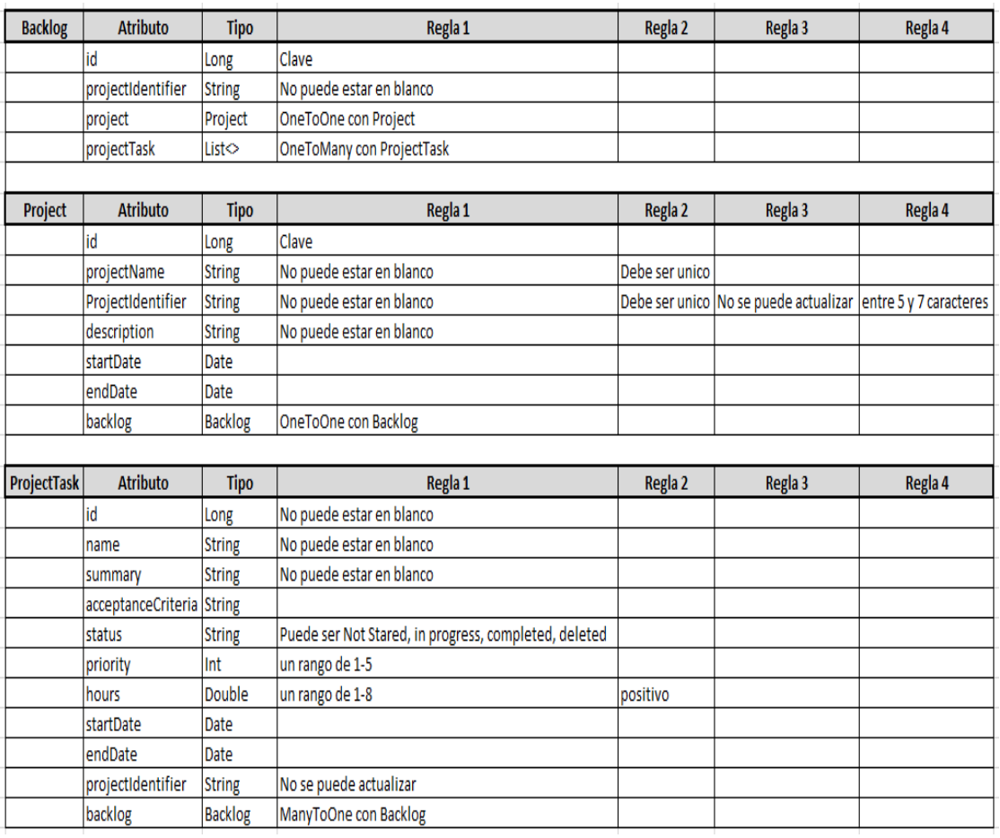
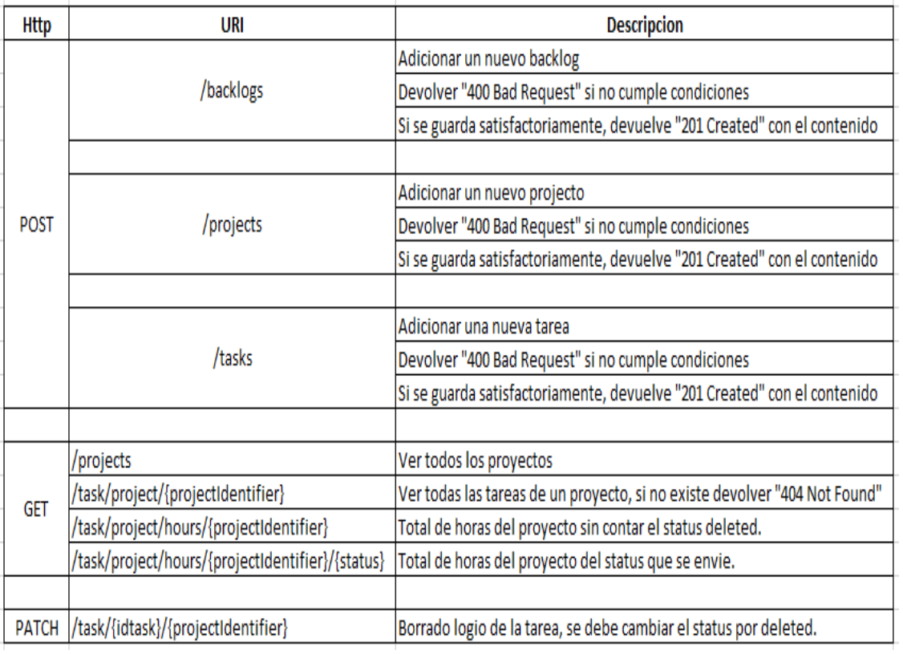

# Microservicio Bakclog

## Dominio

## Consideraciones de Negocio
* En la creación de un Backlog y un ProjectTask se debe validar que el sea el mismo que tiene asociado el Project.
* La respuesta de la API Restfull debe ser una clase tipo Response

## Consideraciones
* Se deben Aplicar los conceptos vistos en clase.
* Crear un microservicio con Spring Boot
* Hacer una prueba unitaria a la capa de repositorio y la capa de servicio (lógica)
* Desplegar los microservicios en Heroku (0.4)
* Implementar librerías commons (0.3 investigar)
* Implementar capa DTO (0.3 investigar)
* Implementar openAPI
* El taller se puede realizar en parejas.
* Fecha Entrega: 23-28 de mayo de 2022
* Fecha Sustentación: 23-28 de mayo de 2022

## Contrato para cada API de los microservicios.

# RECURSOS

## Documentación Open API
La definición de Open API se encuentra en la siguiente 

Ruta: `src/main/resources/templates/openapi.yaml`

## Postman

La colección para importar en la aplicación de Postman se encuentra en la siguiente ruta

Ruta: `src/main/resources/templates/Cloud Computing - Backlog.postman_collection.json `

